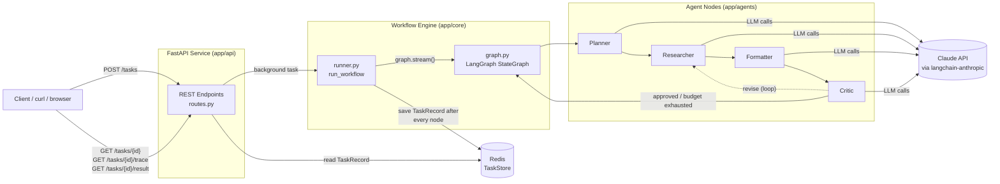
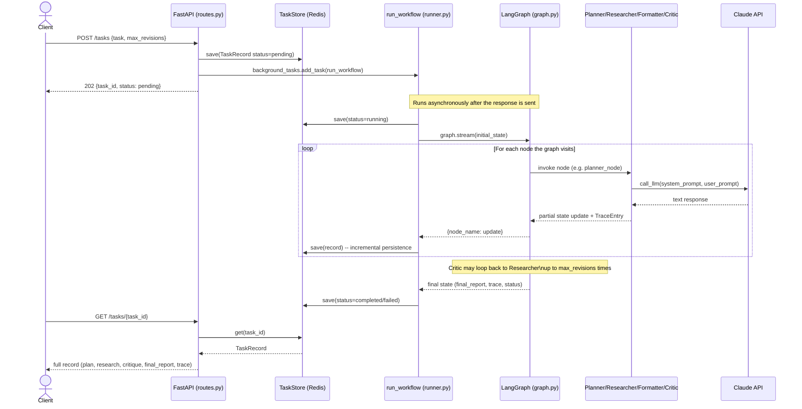
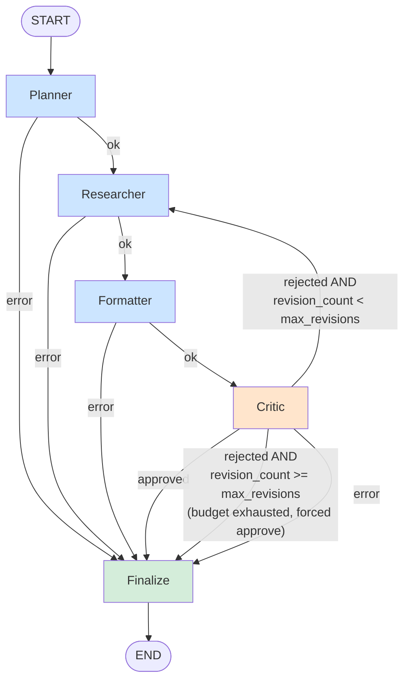
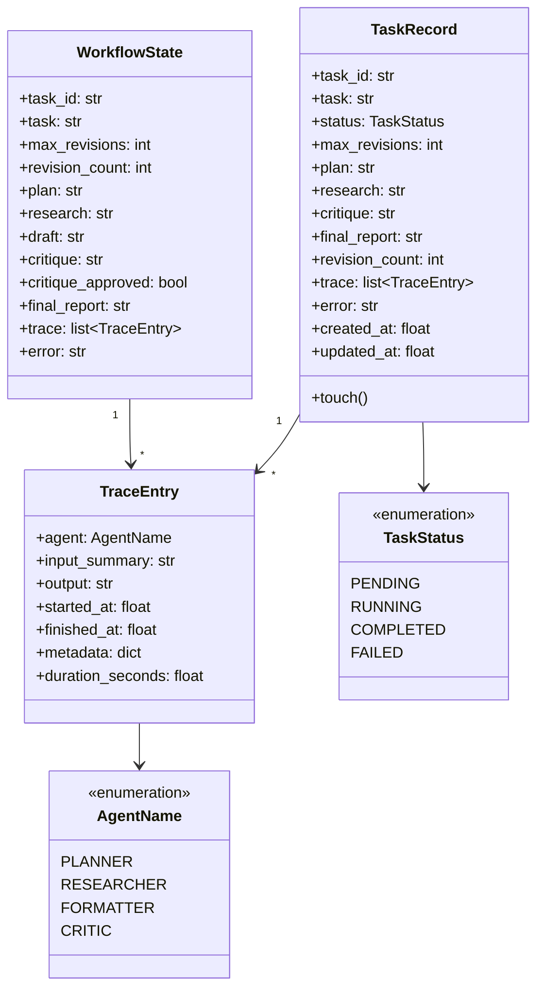

# Multi-Agent Workflow Engine — Project Blueprint

This document is a complete onboarding guide for an engineer who has never seen
this codebase. It explains what the project does, how it's structured, how
data flows through the system, and what every file is responsible for.

---

## 1. What This Project Is

A backend service that takes a natural-language task (e.g. *"Write a report on
renewable energy trends"*) and produces a polished Markdown report by running
it through a pipeline of four cooperating AI agents:

| Agent | Role |
|---|---|
| **Planner** | Breaks the task into a structured outline / research plan |
| **Researcher** | Gathers/synthesizes findings for each part of the plan |
| **Formatter** | Turns the plan + research into a polished Markdown report |
| **Critic** | Reviews the draft and either approves it or sends it back for revision |

The pipeline is not strictly linear — the Critic can reject the draft and send
it back to the Researcher for another pass, up to a configurable number of
times ("revision budget"). If the budget runs out, the best draft produced so
far ships as the final result.

The whole pipeline is modeled as a **graph** (using LangGraph) where each agent
is a node and the edges define what happens next. The graph runs inside a
**FastAPI** web service. Every task and its full step-by-step trace (what each
agent received and produced, how long it took) is stored in **Redis** so a
client can submit a task and poll for progress/results.

### Tech Stack

- **LangGraph** — the state machine / agent orchestration framework
- **LangChain (langchain-anthropic)** — wraps the Claude API for LLM calls
- **FastAPI** — REST API layer
- **Redis** — persistent store for task state + agent traces
- **Pydantic** — data models / validation
- **Docker Compose** — runs the API + Redis together
- **pytest + fakeredis** — test suite that runs with no real Redis or API key

---

## 2. High-Level Architecture

---

## 3. Request Lifecycle (Sequence Diagram)

---

## 4. The LangGraph State Machine (Agent Flow)

**Key control-flow rules** (all implemented in `app/core/graph.py`):

- If any agent node raises an exception, `state["error"]` is set and the graph
  short-circuits straight to `Finalize` — no further agents run.
- The **Critic** returns a JSON verdict `{"approved": bool, "feedback": str}`.
  - If `approved=true` → graph ends, `final_report` = the current draft.
  - If `approved=false` and `revision_count < max_revisions` → loop back to
    **Researcher**, which revises its findings based on the critic's feedback,
    then **Formatter** re-drafts, then **Critic** reviews again.
  - If `approved=false` and the revision budget is exhausted, the Critic
    forces `approved=true` (with a note in the feedback) so the best-effort
    draft ships as the final report.

---

## 5. Data Model: `WorkflowState` vs `TaskRecord`

There are two related but distinct data structures — understanding the
difference is important:

- **`WorkflowState`** (`app/core/state.py`) — an in-memory `TypedDict` that
  flows *between LangGraph nodes during a single run*. Each node receives the
  current state and returns a partial update dict that LangGraph merges in.
- **`TaskRecord`** (`app/models/schemas.py`) — the *persisted* representation
  in Redis, including status (`pending`/`running`/`completed`/`failed`),
  timestamps, and the full trace. `runner.py` copies relevant fields from each
  `WorkflowState` update onto the `TaskRecord` and saves it after every node.

---

## 6. File-by-File Blueprint

### Project Root

| File | Purpose |
|---|---|
| `README.md` | User-facing setup/run/API docs |
| `requirements.txt` | Production Python dependencies |
| `requirements-dev.txt` | Adds pytest, fakeredis, pytest-cov for testing |
| `.env.example` | Template for environment variables (copy to `.env`) |
| `.gitignore` | Standard Python/venv/env ignores |
| `pytest.ini` | Pytest configuration (test discovery, warning filters) |
| `git_push.sh` / `git_push.bat` | One-command git init/commit/push helpers (bash / Windows) |
| `setup.bat` | Windows: creates venv, installs deps, copies `.env` |
| `run_server.bat` | Windows: runs the API locally with uvicorn (needs local Redis) |
| `run_docker.bat` | Windows: `docker compose up/down/logs` wrapper |
| `run_tests.bat` | Windows: runs the full pytest suite |

### `docker/` — Containerization

| File | Purpose |
|---|---|
| `Dockerfile` | Builds the FastAPI app image; installs `requirements.txt`, runs `uvicorn app.api.main:app` |
| `docker-compose.yml` | Defines two services: `redis` (image `redis:7-alpine`) and `api` (built from `Dockerfile`), wires them together via `REDIS_URL` |

### `app/config.py` — Configuration

Defines `Settings` (pydantic-settings `BaseSettings`), loaded from `.env`:
`anthropic_api_key`, `llm_model`, `redis_url`, `max_critic_revisions`,
`log_level`, etc. A single `settings` singleton is imported everywhere
configuration is needed.

### `app/models/schemas.py` — Data Models

Defines the Pydantic models and enums used across the whole app:
- `TaskStatus` (pending/running/completed/failed)
- `AgentName` (planner/researcher/formatter/critic)
- `TraceEntry` — one record per agent step (input summary, output, timing, metadata)
- `TaskRequest` — the JSON body for `POST /tasks`
- `TaskRecord` — the full persisted task object stored in Redis

### `app/core/` — Workflow Engine

| File | Purpose |
|---|---|
| `state.py` | Defines `WorkflowState` (the LangGraph state schema, a `TypedDict`) and `initial_state()` to construct it for a new run. The `trace` field uses a custom reducer (`_append`) so each node's `TraceEntry` is **appended**, not overwritten. |
| `graph.py` | Builds and compiles the LangGraph `StateGraph`. Wires up the 4 agent nodes + a `finalize` node, defines all conditional edges (error short-circuiting, the critic's approve/revise/budget-exhausted routing), and exposes `build_graph()`. |
| `llm_client.py` | Thin wrapper around `langchain_anthropic.ChatAnthropic`. Provides `get_llm()` (cached client) and `call_llm(system_prompt, user_prompt, temperature)` which all 4 agents call to talk to Claude. |
| `store.py` | `TaskStore` — Redis-backed CRUD for `TaskRecord`. Stores each task as a JSON blob under `task:{task_id}` with a 7-day TTL, plus a sorted set (`tasks:index`) for listing recent tasks by creation time. Also provides `healthcheck()`. |
| `runner.py` | `run_workflow(task_id, task, max_revisions, store)` — the bridge between the stateless graph and persisted state. Loads/creates a `TaskRecord`, streams the graph step-by-step via `graph.stream(state, stream_mode="updates")`, and after **every single node** copies the relevant fields onto the `TaskRecord` and saves it to Redis. This is what makes live polling possible. |

### `app/agents/` — The Four Agents

Each agent module exports a single `*_node(state: WorkflowState) -> dict`
function (the LangGraph node signature). All of them:
1. Build a prompt from the current state.
2. Call `call_llm(...)`.
3. Wrap the result in a `TraceEntry` via `make_trace_entry()`.
4. Return a partial state update dict.
5. On exception, set `state["error"]` and return early (triggering the
   error short-circuit in `graph.py`).

| File | Purpose |
|---|---|
| `common.py` | Shared helpers: `make_trace_entry()` builds a completed `TraceEntry` with timing; `truncate()` shortens text for trace `input_summary` fields. |
| `planner.py` | `planner_node` — sends the task to Claude with a system prompt asking for a 3-6 point structured outline. Output → `state["plan"]`. |
| `researcher.py` | `researcher_node` — two modes: **initial** (first pass, generates findings from the plan) and **revision** (if `state["critique"]` is set, revises prior research to address the critic's feedback). Output → `state["research"]`. |
| `formatter.py` | `formatter_node` — synthesizes `plan` + `research` (+ critique context on revisions) into a polished Markdown report. Output → `state["draft"]`. |
| `critic.py` | `critic_node` — asks Claude to return JSON `{"approved": bool, "feedback": str}`. `_parse_verdict()` handles plain JSON, markdown-fenced JSON, and non-JSON fallback (defaults to `approved=False`). Increments `revision_count` if rejected; forces `approved=True` if the revision budget is already exhausted. Output → `state["critique"]`, `state["critique_approved"]`, possibly `state["revision_count"]`. |

### `app/api/` — REST Layer

| File | Purpose |
|---|---|
| `main.py` | FastAPI app instance, logging setup, mounts the router, defines `GET /` (root info endpoint). |
| `routes.py` | All HTTP endpoints (see API Reference below). Each request gets a `TaskStore` via `get_store()`. Task submission uses FastAPI's `BackgroundTasks` to run `run_workflow` after the response is returned. |

### `tests/` — Test Suite

| File | Purpose |
|---|---|
| `conftest.py` | Shared fixtures: `fake_redis` (in-memory Redis via `fakeredis`, patched into `store.py`), `llm_responses` (dict of canned per-agent responses), `mock_llm` (patches `call_llm` in all 4 agent modules to route based on the system prompt's agent name). |
| `test_graph.py` | Tests `route_after_critic`, `route_if_error`, and full graph runs: approval on first pass, revision loop, budget exhaustion (including the `max_revisions=0` forced-approval edge case), and error short-circuiting. |
| `test_critic.py` | Unit tests for `_parse_verdict()` — plain JSON, fenced JSON, non-JSON fallback, missing fields. |
| `test_store.py` | `TaskStore` CRUD: save/get, exists, list ordering & limits, delete, mark_failed, trace round-tripping through JSON. |
| `test_runner.py` | `run_workflow()` end-to-end with mocked LLM: success, revision loop, failure, auto-creating a record if missing. |
| `test_api.py` | Full HTTP lifecycle via `TestClient`: health check, create/get/list/delete tasks, trace and result endpoints, 404/409/422/500 error cases. |

### `scripts/smoke_test.py`

A standalone manual end-to-end script (not part of pytest) that boots the
FastAPI app with mocked LLM responses and walks through the entire
submit → poll → trace → result → list → delete flow. Useful for a quick sanity
check without spending API credits.

---

## 7. API Reference (Quick Summary)

| Method & Path | Purpose |
|---|---|
| `GET /health` | Liveness + Redis connectivity check |
| `POST /tasks` | Submit a new task `{task, max_revisions?}` → `202 {task_id, status}` |
| `GET /tasks` | List recent tasks (`?limit=N`, default 50, max 200) |
| `GET /tasks/{task_id}` | Full `TaskRecord` (status, plan, research, critique, final_report, trace) |
| `GET /tasks/{task_id}/trace` | Just the agent trace |
| `GET /tasks/{task_id}/result` | Final report only (`409` if not done, `500` if failed) |
| `DELETE /tasks/{task_id}` | Delete a task record |

---

## 8. How a Task's State Evolves (Example Timeline)

```mermaid
gantt
    dateFormat  X
    axisFormat %s
    title Example: task with one revision (max_revisions=2)

    section Pipeline
    Planner runs        :a1, 0, 2
    Researcher (pass 1) :a2, after a1, 3
    Formatter (pass 1)  :a3, after a2, 2
    Critic (rejects)    :crit, a4, after a3, 1
    Researcher (pass 2) :a5, after a4, 3
    Formatter (pass 2)  :a6, after a5, 2
    Critic (approves)   :a7, after a6, 1
    Finalize             :a8, after a7, 1
```

At each numbered step above, `runner.py` writes an updated `TaskRecord` to
Redis — so a client polling `GET /tasks/{id}` mid-run will see `status:
running`, the fields filled in so far (`plan`, `research`, etc.), and a
growing `trace` array.

---

## 9. Extending the Project (Pointers for Future Work)

- **New agent**: add `app/agents/<name>.py` with a `*_node` function following
  the same pattern (trace entry + error handling), then wire it into
  `app/core/graph.py`.
- **Different LLM/provider**: change `app/core/llm_client.py` only — everything
  else calls `call_llm()` and doesn't know which provider is behind it.
- **Streaming results to clients**: `runner.py` already streams node-by-node
  internally; an SSE/WebSocket endpoint in `routes.py` could expose that same
  stream live instead of requiring polling.
- **Persistent worker / queue**: currently `BackgroundTasks` runs the workflow
  in-process. For higher throughput, swap this for a Celery/RQ worker that
  calls `run_workflow()`, since the function signature is already
  queue-friendly (plain arguments, no request context).
